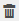

= 信頼できないドメインのリソースを管理します
:icons: font
:imagesdir: ../media/

[role="lead"]
SnapCenter は、 Active Directory （ AD ）の信頼できるドメイン内のホストの管理に加えて、複数の AD の信頼されていないドメイン内のホストも管理します。信頼されていない AD ドメインを SnapCenter サーバに登録する必要があります。SnapCenter では、複数の信頼されていない AD ドメインのユーザとグループがサポートされます

SnapCenter サーバは、ドメインまたはワークグループ内のマシンにインストールできます。SnapCenter サーバをインストールするには、マシンがドメイン内にある場合はドメインのクレデンシャル、ワークグループ内にある場合はローカルの管理者クレデンシャルを指定する必要があります。

SnapCenter サーバに登録されていないドメインに属する Active Directory （ AD ）グループはサポートされていません。これらの AD グループを使用して SnapCenter ロールを作成できますが、 SnapCenter サーバへのログインが失敗し、次のエラーメッセージが表示されます。 The user are trying to login does not belong to any roles管理者に問い合わせてください。

== 信頼できないドメインを変更します

信頼されていないドメインを変更するのは、ドメインコントローラの IP アドレスまたは Fully Qualified Domain Name （ FQDN ；完全修飾ドメイン名）を更新する場合です。

* このタスクについて *

FQDN を変更すると、関連付けられているアセット（ホスト、ユーザ、およびグループ）が想定どおりに機能しなくなる場合があります。

信頼されていないドメインを変更するには、 SnapCenter ユーザインターフェイスまたは PowerShell コマンドレットを使用します。

* 手順 *

. 左側のナビゲーションペインで、 * 設定 * をクリックします。
. 設定ページで、 * グローバル設定 * をクリックします。
. [ グローバル設定 ] ページで、 [* ドメイン設定 * ] をクリックします。
. をクリックします image:../media/edit_icon.gif["編集アイコン"]をクリックし、次の情報を指定します。
+
|===
| フィールド | 手順 

 a| 
ドメイン FQDN
 a| 
FQDN を指定し、 * resolve * をクリックします。

 a| 
ドメインコントローラの IP アドレス
 a| 
ドメイン FQDN を解決できない場合は、ドメインコントローラの IP アドレスを 1 つ以上指定します。

|===
. [OK] をクリックします。

== 信頼されていない Active Directory ドメインの登録を解除

ドメインに関連付けられたアセットを使用しないようにするには、信頼されていない Active Directory ドメインの登録を解除します。

* 必要なもの *

信頼されていないドメインに関連付けられているホスト、ユーザ、グループ、およびクレデンシャルを削除しておく必要があります。

* このタスクについて *

* ドメインを SnapCenter サーバから登録解除すると、そのドメインのユーザは SnapCenter サーバにアクセスできなくなります。
* 関連付けられているアセット（ホスト、ユーザ、およびグループ）がある場合、ドメインの登録を解除すると、アセットを操作できなくなります。
* 信頼されていないドメインの登録を解除するには、 SnapCenter ユーザインターフェイスまたは PowerShell コマンドレットを使用します。

* 手順 *

. 左側のナビゲーションペインで、 * 設定 * をクリックします。
. 設定ページで、 * グローバル設定 * をクリックします。
. [ グローバル設定 ] ページで、 [* ドメイン設定 * ] をクリックします。
. ドメインのリストから、登録を解除するドメインを選択します。
. をクリックします をクリックし、 * OK * をクリックします。

