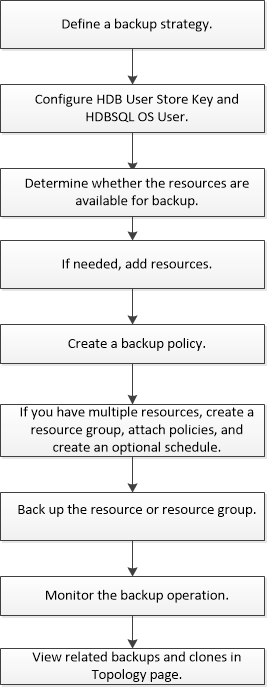

= SAP HANA のリソースをバックアップ
:icons: font
:imagesdir: ../media/

[role="lead"]
リソース（データベース）またはリソースグループのバックアップを作成することができます。バックアップのワークフローには、計画、バックアップするデータベースの特定、バックアップポリシーの管理、リソースグループの作成とポリシーの適用、バックアップの作成、処理の監視が含まれます。

次のワークフローは、バックアップ処理の実行順序を示しています。

PowerShell コマンドレットを手動またはスクリプトで使用して、バックアップ、リストア、クローニングの処理を実行することもできます。PowerShell コマンドレットの詳細については、 SnapCenter のコマンドレットのヘルプを使用するか、コマンドレットのリファレンス情報を参照してください。https://library.netapp.com/ecm/ecm_download_file/ECMLP2877143["SnapCenter ソフトウェアコマンドレットリファレンスガイド"^]。
