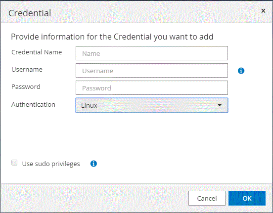

= SnapCenter Plug-in for SAP HANA Databaseのクレデンシャルを設定する
:allow-uri-read: 
:icons: font
:imagesdir: ../media/

[role="lead"]
SnapCenterでは、クレデンシャルを使用してSnapCenter処理のユーザを認証します。SnapCenterプラグインのインストールに使用するクレデンシャルと、データベースまたはWindowsファイルシステムでデータ保護処理を実行するためのクレデンシャルをそれぞれ作成する必要があります。

.タスクの内容
* Linuxホスト
+
Linuxホストにプラグインをインストールするには、クレデンシャルを設定する必要があります。

+
このクレデンシャルは、rootユーザ、またはプラグインをインストールしてプロセスを開始するsudo Privilegesがあるroot以外のユーザに対して設定する必要があります。

+
|===

| * ベストプラクティス： * ホストを導入してプラグインをインストールしたあとに Linux のクレデンシャルを作成することは可能ですが、 SVM を追加したあとで、ホストを導入してプラグインをインストールする前にクレデンシャルを作成することを推奨します。 
|===
* Windowsホスト
+
プラグインをインストールする前にWindowsクレデンシャルを設定する必要があります。

+
このクレデンシャルには、管理者権限（リモートホストに対する管理者権限を含む）を設定する必要があります。

個 々 のリソースグループのクレデンシャルを設定し、ユーザ名に完全なadmin権限がない場合は、少なくともリソースグループとバックアップの権限を割り当てる必要があります。

.手順
. 左側のナビゲーションペインで、 * 設定 * をクリックします。
. [ 設定 ] ページで、 [* 資格情報 ] をクリックします。
. [ 新規作成（ New ） ] をクリックする。
+

. [クレデンシャル]ページで、クレデンシャルの設定に必要な情報を指定します。
+
|===
| フィールド | 操作 

 a| 
クレデンシャル名
 a| 
クレデンシャルの名前を入力します。

 a| 
ユーザ名
 a| 
認証に使用するユーザ名とパスワードを入力します。

** ドメイン管理者または管理者グループの任意のメンバー
+
ドメイン管理者またはSnapCenterプラグインをインストールするシステムの管理者グループの任意のメンバーを指定します。ユーザ名フィールドの有効な形式は次のとおりです。

+
*** NETBIOS_USERNAME_
*** _ ドメイン FQDN\ ユーザ名 _

** ローカル管理者（ワークグループのみ）
+
ワークグループに属するシステムの場合は、SnapCenterプラグインをインストールするシステムに組み込みのローカル管理者を指定します。ユーザ アカウントに昇格された権限がある場合、またはホスト システムでユーザ アクセス制御機能が無効になっている場合は、ローカル管理者グループに属するローカル ユーザ アカウントを指定できます。Username フィールドの有効な形式は、 _username_ です

+
パスワードに二重引用符（"）またはバックティック（`）を使用しないでください。小なり（<）と感嘆符（！）は使用しないでください。 パスワードに記号を追加します。たとえば、lessthan <！10、lessthan10 <！、backtick 12とします。

 a| 
パスワード
 a| 
認証に使用するパスワードを入力します。

 a| 
認証モード
 a| 
使用する認証モードを選択します。

 a| 
sudo権限を使用
 a| 
root 以外のユーザのクレデンシャルを作成する場合は、「 * sudo 権限を使用する * 」チェックボックスをオンにします。

NOTE: Linuxユーザのみに適用されます。

|===
. [OK]*をクリックします。

クレデンシャルの設定が完了したら、必要に応じて[User and Access]ページでユーザまたはユーザグループにクレデンシャルを割り当てることができます。
