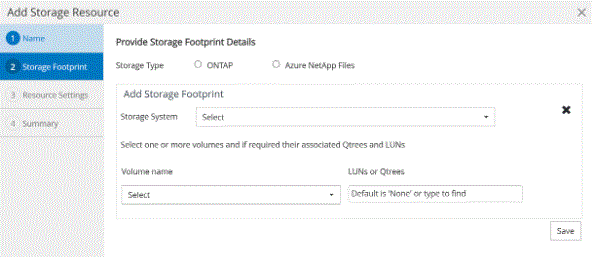

= NetAppがサポートするプラグインにリソースを追加する
:allow-uri-read: 
:icons: font
:imagesdir: ../media/

[role="lead"]
バックアップまたはクローンを作成するリソースを追加する必要があります。環境によっては、バックアップまたはクローンを作成するデータベースインスタンスやそのコレクションがリソースに含まれる場合があります。

.開始する前に
* SnapCenterサーバのインストール、ホストの追加、ストレージシステム接続の作成、クレデンシャルの追加などのタスクを完了しておく必要があります。
* SnapCenter サーバにプラグインをアップロードしておく必要があります。

.手順
. 左側のナビゲーションペインで、*[リソース]*を選択し、リストから適切なプラグインを選択します。
. [リソース]ページで、*[リソースの追加]*を選択します。
. [Provide Resource Details]ページで、次の操作を実行します。
+
|===
| フィールド | 操作 

 a| 
名前
 a| 
リソースの名前を入力します。

 a| 
ホスト名
 a| 
ホストを選択します。

 a| 
タイプ
 a| 
タイプを選択します。タイプは、プラグインの説明ファイルに従ってユーザー定義されています。たとえば、データベースやインスタンスなどです。

選択したタイプに親がある場合は、親の詳細を入力します。たとえば、タイプがデータベースで、親がインスタンスの場合は、インスタンスの詳細を入力します。

 a| 
クレデンシャル名
 a| 
クレデンシャルを選択するか、新しいクレデンシャルを作成します。

 a| 
マウントパス
 a| 
リソースがマウントされているマウントパスを入力します。これは、Windowsホストにのみ該当します。

|===
. [ストレージフットプリントの入力]ページで、ストレージシステムを選択して1つ以上のボリューム、LUN、およびqtreeを選択し、*[保存]*を選択します。
+
オプション：他のストレージシステムからボリューム、LUN、およびqtreeを追加する場合は、アイコンを選択します image:../media/add_policy_from_resourcegroup.gif["プラスアイコン"] 。

+

NOTE: NetAppでサポートされているプラグインでは、リソースの自動検出がサポートされていません。物理環境と仮想環境のストレージの詳細も自動検出されません。リソースの作成時に、物理環境と仮想環境のストレージの情報を指定する必要があります。

+

. [Resource Settings]ページで、リソースのカスタムのキーと値のペアを指定します。
+

NOTE: カスタムキー名が大文字であることを確認します。

+
image::../media/resource_settings.gif[リソース設定]

+
各プラグインパラメータについては、を参照してください。 link:add_resources_to_netapp_supported_plugins.html#parameters-to-configure-the-resource["リソースを構成するパラメータ"]

. 概要を確認し、*[終了]*を選択します。

.結果
リソースは、タイプ、ホストまたはクラスタ名、関連するリソースグループとポリシー、全体的なステータスなどの情報とともに表示されます。

IMPORTANT: SnapCenter以外でデータベースの名前が変更された場合は、リソースを更新する必要があります。

.終了後
アセットへのアクセスを他のユーザに許可する場合は、 SnapCenter 管理者が対象のユーザにアセットを割り当てる必要があります。これにより、ユーザは自分に割り当てられているアセットに対して権限のある操作を実行できます。

リソースを追加したら、リソースの詳細を変更できます。NetAppでサポートされるプラグインリソースにバックアップが関連付けられている場合、リソース名、リソースタイプ、およびホスト名のフィールドは変更できません。

== リソースを構成するパラメータ

プラグインを手動で追加する場合は、[Resource Settings]ページで次のパラメータを使用してリソースを設定できます。

=== MongoDB向けプラグイン

リソース設定：

* MongoDB_APP_SERVER=（リソースタイプが共有クラスタの場合）またはMongoDB_ReplicaSet_SERVER=（リソースタイプがレプリカセットの場合）
* oplog_path=（MongoDB.propertiesfileから提供される場合はオプションパラメータ）
* MongoDB_authentication_type=（LDAP認証の場合はplain、その他の場合はNone）

MongoDB.propertiesファイルには、次のパラメータを指定する必要があります。

* disable_starting_stoping_services=
+
** n：プラグインによって開始/停止サービスが実行される場合。
** ユーザがSTART/** STOPサービスを実行した場合はY。
** オプションのパラメータをデフォルト値としてNに設定します。

* oplog_path_=（SnapCenterでカスタムのキーと値のペアとしてすでに指定されている場合はオプションパラメータ）

=== MaxDB用プラグイン

リソース設定：

* XUSER_ENABLE(Y|N)データベースユーザにパスワードを要求しないように、MaxDBのxuserの使用を有効または無効にします。
* HANDLE_LOGWRITER(Y|N)一時停止Logwriter(N)または再開Logwriter(Y)操作を実行します。
* DBMCLICMD（path_to_dbmcli_cmd）は、MaxDBのdbmcliコマンドへのパスを指定します。設定しない場合は、検索パスのdbmcliが使用されます。

NOTE: Windows環境では、パスは二重引用符（"..."）で囲む必要があります。

* SQLCLICMD（path_to_sqlcli_cmd）は、MaxDB sqlcliコマンドへのパスを指定します。パスが設定されていない場合は、検索パスにsqlcliが使用されます。
* MaxDB_UPDATE_HIST_LOG (Y|N)は、MaxDBバックアッププログラムにMaxDB履歴ログを更新するかどうかを指示します。
* MaxDB_CHECK_SNAPSHOT_DIR：例、SID1：DIRECTORY [、DIRECTORY ...]；[SID2：DIRECTORY [、DIRECTORY ...] Snap CreatorのSnapshotコピー処理が成功したこと、およびSnapshotが作成されたことを確認します。
+
この環境 NFS のみ。このディレクトリには、 .snapshot ディレクトリが含まれている場所を指定する必要があります。複数のディレクトリを指定する場合は、カンマで区切って指定できます。

+
MaxDB 7.8 以降のバージョンでは、データベースバックアップ要求がバックアップ履歴で失敗とマークされています。

* maxDB_backup_templates：各データベースのバックアップテンプレートを指定します。
+
テンプレートが存在し、外部タイプのバックアップテンプレートである必要があります。MaxDB 7.8以降でスナップショット統合を有効にするには、MaxDBバックグラウンドサーバ機能があり、外部タイプのMaxDBバックアップテンプレートがすでに設定されている必要があります。

* MaxDB_BG_SERVER_PREFIX：バックグラウンドサーバ名のプレフィックスを指定します。
+
MaxDB のバックアップテンプレートパラメータを設定する場合は、 MaxDB の BG_server_prefix パラメータも設定する必要があります。プレフィックスを設定しない場合は、デフォルト値na_bg_が使用されます。

=== SAP ASE向けプラグイン

リソース設定：

* sybase_server（data_server_name）は、Sybaseデータサーバ名を指定します（isqlコマンドの-Sオプション）。たとえば、p_testのように指定します。
* sybase_databases_exclude（db_name）を使用すると、「all」構成要素が使用されている場合にデータベースを除外できます。
+
複数のデータベースを指定するには、セミコロンで区切ったリストを使用します。例：pubs2;test_db1。

* sybase_user: user_nameには'isqlコマンドを実行できるオペレーティング・システム・ユーザを指定します
+
UNIXの場合は必須です。このパラメータは、Snap Creatorエージェントのstartコマンドとstopコマンドを実行するユーザ（通常はrootユーザ）とisqlコマンドを実行するユーザが異なる場合に必要です。

* Sybase_Tran_dump db_name：directory_pathを使用すると'スナップショットの作成後にSybaseトランザクションダンプを実行できます例：pubs2:/sybasedumps/pubs2
+
トランザクションダンプが必要な各データベースを指定する必要があります。

* Sybase_Tran_dump_compress (Y|N) Sybaseトランザクションダンプのネイティブ圧縮を有効または無効にします。
* Sybase_ISQL_CMD（たとえば、/opt/Sybase/OCS-15_0/bin/isql）は、isqlコマンドへのパスを定義します。
* Sybase_exclude_tempdb（Y|N）を使用すると、ユーザが作成した一時データベースを自動的に除外できます。

=== Oracleアプリケーション向けプラグイン（ORASCPM）

リソース設定：

* sqlplus_cmdは、sqlplusへのパスを指定します。
* ORACLE_DATABASESには、バックアップするOracleデータベースと対応するユーザ（database：user）が一覧表示されます。
* CNTL_FILE_BACKUP_DIRは、制御ファイルのバックアップ先ディレクトリを指定します。
* ORA_TEMPは、一時ファイルのディレクトリを指定します。
* ORACLE_HOMEには、Oracleソフトウェアがインストールされているディレクトリを指定します。
* archive_log_onlyは、アーカイブログをバックアップするかどうかを指定します。
* oracle_backup_modeは、オンラインバックアップとオフラインバックアップのどちらを実行するかを指定します。

