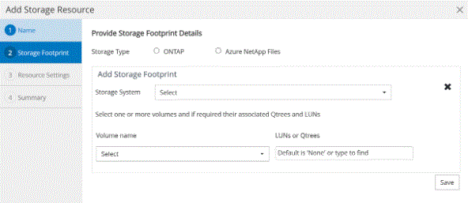

= fdadbc4689c75884565947c7d9c98734
:allow-uri-read: 
:icons: font
:imagesdir: ../media/

[role="lead"]
48f5a315d78b006c306e66d7b35fa6f4

.135b308ed83c53f1516b7c754566d1c4
* 04e793c2d8facdc933edd3335c890a34
* 2f1bb1e2ce78c864a4c44750e9b9b27c
* 797f1e031962d70e46335925184febf4

.f3a29486bed19a90f2da6d007818b427
. 0b5045b3b137ebb25cf08b5081075426
. b828f6db4e08909e879dfbf229208eff
. 14fdd328e53552c727d0f36c3d306b64
+
|===
| 21f831502a413a739e20cbf9f2eefe54 | 5e2ad6fd9deb412d871137094ee43ef0 

 a| 
49ee3087348e8d44e1feda1917443987
 a| 
0750f05e0542388153777a63b5fa887c

 a| 
dae4a538d4ca7b6c0789932062fe718d
 a| 
d82b9729484cf5fd2948c596280e72fb

 a| 
a1fa27779242b4902f7ae3bdd5c6d508
 a| 
0e4c9e1ee0802a727d5dd0fcacc4a158

d51f353d18e7a9243a31897eda8f33de

 a| 
a5f3bff0d7667c1bb37c185dbaac3ff8
 a| 
22d904afc998596607ae9259692598fb

 a| 
16e83f7e57633cd58a4377b7c1b63e8b
 a| 
1b77d8b94cdc028e50a0681f82c70f25

|===
. 20fc40c342831a6dee50cd66efb74566
+
a28f52bcf0c820558e017ed65d61bbc4

+

NOTE: 5b31c6defa650e8eede236c9a524ad39

+

. d98e943b0122d016274bcbbeba1d647d
+

NOTE: 5c2c5b6203d8891127217c96e3fbe1b9

+
image::../media/resource_settings.gif[e7406b64381fc805ceaee3d2f62a905c]

+
3f7f4b4e15fb13c07226ae5e8b35a6f8

. 7444cb400c788a3d3aad71fb264fbbee

.8eea62084ca7e541d918e823422bd82e
e17cc09362fa60a61b045f3553620d2c

IMPORTANT: 82f28b0f3a541b232ddcbe7c091f64e7

.bd965e38a0c9cf27aa1bde099308e23f
3ccbcc5da83c6d1a88dc8bcc16bad81b

19e0df9603aca24ac2e353610c9a2595

== 908ce55b9da44ee27d03ed171ddea2e7

953d8aa26b3ddc6ef9cb0d313bf6b37c

=== 73983f1a2e95d99410b33aa88c8d1553

600e3309232549251ca640cb2342dfde

* e9ddc733b3e6c17e18926d04d62986de
* 927bec3e40fa9a147f44662b84721dd9
* 03736e919d63a5b6c12cd3932b0ee757

004fbb3dfd245e71dabcc6a75db3fbb2

* df4a3aea55de7806974b34f710fe9e4d
+
** 98109f825501c3cb72b00e1fe79695b2
** 2d313527d9889e015fd736c0788d3146
** 5773ae9a295e538d0059e98db38eeba6

* 65353844f406b5f277c2298c9de28a4d

=== 49511ddb8201bb96603eb808d2a3e28f

600e3309232549251ca640cb2342dfde

* b411eb4c2fa661e74171410d1ab4bd48
* 8cd4cecb4cdb8d9c30223764a3a903eb
* 3145067569fb820b87645966c6f53b09

NOTE: 66619cba37760dcecc43382e0d79b255

* 70540c6eb6372721dc72da9704b0e951
* 553db31592e8608dc154043f1277223f
* 31d8946dd7b37335bf135433dfba1c1e
+
a83970415359c312ddce75ae580f0225

+
4417fa132d4a54d57723d3e0c10c8d49

* 3822bf8d2dc90b4a6f73ef50d9ea775b
+
eebb4c734f3f1079fd5d41eea32a2d1e

* 9477337b7878a4f25ccde00ea9416b9b
+
16bfac97af8708431c25ec2291a1e479

=== 00776d7e76d2ff924005283f8a850e22

600e3309232549251ca640cb2342dfde

* 341a000d7d6fb3a7fffdc617dffab5d1
* b86cb3989b481da0c083baf1da18da20
+
940b268cac3ed1330e0f7e0319d1e859

* 97cc319bb457d56d47830d6de77ba4ad
+
ebf4dad38777f88ec1b5e116ba37b3a4

* e46a8315478b6b916cdbb1fd118de1c0
+
66afa311d7576c91c34cb54fcf03b40b

* f3ff800bf59b3e292e273cbb5144e981
* eb733da6d91024122221fa2aa260156e
* cd740fe9314eab6d0c2592fc2105153a

=== a7d333f84206b65d56d2716470463c89

600e3309232549251ca640cb2342dfde

* 06c9ae76a61320ac1c236face000c979
* 5f379444506221aba90e302dc3c20d38
* c97084cff38819819afb580bd07f2b05
* 0b12a00876503fb1813afee6ad9b0a76
* e1ab4aa639aa539548c7d55759dc7004
* 57808f9033b6670d0e1ff1ecc8197488
* 6d6058c414d1170875e11ce8a19484f0

