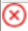

= [Topology]ページでのExchangeバックアップの表示
:allow-uri-read: 
:icons: font
:imagesdir: ../media/

[role="lead"]
リソースのバックアップを準備する際には、プライマリストレージとセカンダリストレージ上のすべてのバックアップの図を表示すると役立つことがあります。

.タスクの内容
[Topology]ページでは、選択したリソースまたはリソースグループに使用可能なすべてのバックアップを確認できます。これらのバックアップの詳細を表示し、選択してデータ保護処理を実行できます。

プライマリストレージとセカンダリストレージ（ミラーコピーまたはバックアップコピー）のどちらにバックアップがあるかを確認するには、[コピーの管理]ビューの次のアイコンを確認します。

* image:../media/topology_primary_storage.gif["プライマリストレージアイコン"] プライマリストレージで使用可能なバックアップの数が表示されます。
* image:../media/topology_mirror_secondary_storage.gif["セカンダリストレージミラーアイコン"] SnapMirrorテクノロジを使用してセカンダリストレージにミラーリングされているバックアップの数が表示されます。
* image:../media/topology_vault_secondary_storage.gif["セカンダリストレージバックアップアイコン"] SnapVaultテクノロジを使用してセカンダリストレージにレプリケートされたバックアップの数が表示されます。
+
** 表示されるバックアップの数には、セカンダリストレージから削除されたバックアップも含まれます。
+
たとえば、バックアップを4つだけ保持するポリシーを使用して6つのバックアップを作成した場合、バックアップの数は6と表示されます。

+
|===

| * ベストプラクティス： * 正しい数のレプリケートされたバックアップが表示されるように、トポロジを更新することを推奨します。 
|===

セカンダリ関係がSnapMirrorのアクティブな同期（当初はSnapMirrorビジネス継続性[SM-BC]としてリリース）である場合は、次のアイコンも表示されます。

* image:../media/topology_replica_site_up.png["レプリカサイトアップ"]レプリカサイトは稼働しています。
* レプリカサイトはダウンしています。
* image:../media/topology_reestablished.png["関係が再確立されました"]セカンダリミラー関係またはバックアップ関係が再確立されていません。

.手順
. 左側のナビゲーションペインで、 * リソース * をクリックし、リストから適切なプラグインを選択します。
. [ リソース ] ページで、データベース、リソース、またはリソースグループを *View * ドロップダウン・リストから選択します。
. データベースの詳細ビューまたはリソースグループの詳細ビューでリソースを選択します。
+
リソースが保護されている場合は、選択したリソースのトポロジページが表示されます。

. [Summary card]セクションで、プライマリストレージとセカンダリストレージにあるバックアップ数の概要を確認します。
+
[Summary Card]セクションには、バックアップの総数とログバックアップの総数が表示されます。

+
「 * Refresh * 」ボタンをクリックすると、ストレージの照会が開始され、正確な数が表示されます。

+
SnapLockが有効なバックアップが作成された場合、*[Refresh]*ボタンをクリックすると、ONTAPから取得されたプライマリおよびセカンダリSnapLockの有効期限が更新されます。週次スケジュールでは、ONTAPから取得したプライマリおよびセカンダリのSnapLock有効期限も更新されます。

+
アプリケーションリソースが複数のボリュームに分散している場合、バックアップのSnapLock有効期限は、ボリューム内のSnapshotに設定されている最長のSnapLock有効期限になります。最長のSnapLock有効期限がONTAPから取得されます。

+
SnapMirrorのアクティブな同期の場合、*[リフレッシュ]*ボタンをクリックすると、プライマリサイトとレプリカサイトの両方をONTAPに照会して、SnapCenterバックアップインベントリが更新されます。週次スケジュールでは、SnapMirrorのアクティブな同期関係を含むすべてのデータベースに対してもこの処理が実行されます。

+
** SnapMirrorのアクティブな同期（ONTAP 9.14.1のみ）では、フェイルオーバー後に新しいプライマリデスティネーションに対する非同期ミラー関係または非同期ミラーバックアップ関係を手動で設定する必要があります。ONTAP 9.15.1以降では、新しいプライマリデスティネーションに対して非同期ミラーまたは非同期ミラーバックアップが自動的に設定されます。フェイルオーバー後。
** フェイルオーバーが完了したら、SnapCenterがフェイルオーバーを認識できるようにバックアップを作成する必要があります。[リフレッシュ]*をクリックできるのは、バックアップが作成されてからです。

. [ コピーの管理 ] ビューで、 [ プライマリストレージまたはセカンダリストレージからの * バックアップ * ] をクリックして、バックアップの詳細を表示します。
+
バックアップの詳細が表形式で表示されます。

. 表でバックアップを選択し、データ保護アイコンをクリックして、リストア、名前変更、削除の各処理を実行します。
+

NOTE: セカンダリストレージにあるバックアップは、名前の変更や削除はできません。Snapshotの削除は、ONTAPの保持設定で処理されます。

