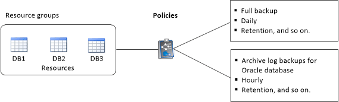

= Oracle データベースのリソースグループを作成してポリシーを適用します
:icons: font
:imagesdir: ../media/

[role="lead"]
リソースグループはコンテナであり、バックアップして保護するリソースをここに追加する必要があります。リソースグループを使用すると、特定のアプリケーションに関連付けられているすべてのデータを同時にバックアップできます。

* このタスクについて *

Oracle DBVERIFY ユーティリティを使用してバックアップを検証するには、 ASM ディスクグループ上にファイルがあるデータベースが「 mount 」または「 open 」状態であることを確認する必要があります。

リソースグループに 1 つ以上のポリシーを適用して、実行するデータ保護ジョブのタイプを定義する必要があります。

次の図は、データベースのリソース、リソースグループ、およびポリシーの関係を示しています。

* 手順 *

. 左側のナビゲーションペインで、 * リソース * をクリックし、リストから適切なプラグインを選択します。
. [ リソース ] ページで、 [ * 新しいリソースグループ * ] をクリックします。
. [ 名前 ] ページで、次の操作を実行します。
+
|===
| フィールド | 手順 

 a| 
名前
 a| 
リソースグループの名前を入力します。

NOTE: リソースグループ名は 250 文字以内にする必要があります。

 a| 
タグ
 a| 
リソースグループを検索するときに役立つラベルを入力します。

たとえば、複数のリソースグループに HR をタグとして追加すると、あとから HR タグに関連付けられたすべてのリソースグループを検索できます。

 a| 
Snapshot コピーには、カスタムの名前形式を使用します
 a| 
Snapshot コピー名にカスタムの名前形式を使用する場合は、このチェックボックスをオンにして名前形式を入力します。

たとえば 'customText_resource group_policy_hostname や resource group_hostname などですデフォルトでは、 Snapshot コピー名の後ろにタイムスタンプが追加されます。

 a| 
バックアップからアーカイブログデスティネーションを除外します
 a| 
バックアップの対象から外すアーカイブログファイルのデスティネーションを指定します。

|===
. Resources ページで、 * Host * ドロップダウン・リストから Oracle データベース・ホスト名を選択します。
+

NOTE: リソースが Available Resources セクションに表示されるのは、リソースが正常に検出された場合のみです。最近リソースを追加した場合は、リソースリストを更新しないと、使用可能なリソースのリストにリソースが表示されません。

. [ 使用可能なリソース（ Available Resources ） ] セクションからリソースを選択し、 [ 選択したリソース（ Selected Resources ） ] セクションに移動する。
+

NOTE: 1 つのリソースグループ内の Linux ホストと AIX ホストの両方からデータベースを追加することができます。

. [Policies] ページで、次の手順を実行します。
+
.. ドロップダウンリストから 1 つ以上のポリシーを選択します。
+

NOTE: をクリックしてポリシーを作成することもできます image:../media/add_policy_from_resourcegroup.gif[""]。

+
[ 選択したポリシーのスケジュールを設定 ] セクションに、選択したポリシーが一覧表示されます。

.. * をクリックしますimage:../media/add_policy_from_resourcegroup.gif[""]* スケジュールを設定するポリシーの [ スケジュールの設定 ] 列。
.. [Add schedules for policy_name] ウィンドウで、スケジュールを設定し、 [*OK*] をクリックします。
+
ここで、 _policy_name_は 選択したポリシーの名前です。

+
設定されたスケジュールは、 [ 適用されたスケジュール ] 列に一覧表示されます。

+
サードパーティ製バックアップスケジュールが SnapCenter バックアップスケジュールと重複している場合、それらのバックアップスケジュールはサポートされません。

. [Verification] ページで、次の手順を実行します。
+
.. Load locators * （ロケータのロード）をクリックして、 SnapMirror または SnapVault ボリュームをロードし、セカンダリ・ストレージ上で検証を実行します。
.. * をクリックしますimage:../media/add_policy_from_resourcegroup.gif[""]* Configure Schedules （スケジュールの設定）列で、ポリシーのすべてのスケジュールタイプの検証スケジュールを設定します。
.. Add Verification Schedules_policy_name_dialog box で、次の処理を実行します。
+
|===
| 状況 | 手順 

 a| 
バックアップ後に検証を実行します
 a| 
[Run verification after backup] を選択します。

 a| 
検証をスケジュールします
 a| 
[Run scheduled verification] を選択し、ドロップダウン・リストからスケジュール・タイプを選択します。

|===
.. セカンダリ・ストレージ・システムのバックアップを検証するには、セカンダリ・サイトで * Verify on secondary location * を選択します。
.. [OK] をクリックします。
+
設定した検証スケジュールは、 Applied Schedules 列にリスト表示されます。

. [ 通知 ] ページの [ 電子メールの設定 *] ドロップダウンリストから、電子メールを送信するシナリオを選択します。
+
また、送信者と受信者の E メールアドレス、および E メールの件名を指定する必要があります。リソースグループで実行された操作のレポートを添付する場合は、 [ ジョブレポートの添付（ Attach Job Report ） ] を選択します。

+

NOTE: E メール通知を利用する場合は、 GUI または PowerShell コマンド Set-SmtpServer を使用して、 SMTP サーバの詳細を指定しておく必要があります。

. 概要を確認し、 [ 完了 ] をクリックします。

