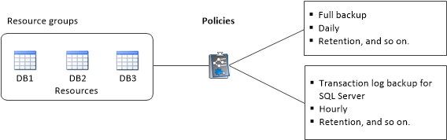

= SQL Server の保護におけるリソース、リソースグループ、ポリシーの使用方法
:icons: font
:imagesdir: ../media/

[role="lead"]
SnapCenter を使用する前に、実行するバックアップ、クローニング、およびリストアの処理に関連する基本的な概念を理解しておくと役立ちます。ここでは、さまざまな処理で扱うリソース、リソースグループ、およびポリシーについて説明します。

* リソースとは、 SnapCenter でバックアップやクローンを作成するデータベース、データベースインスタンス、または Microsoft SQL Server 可用性グループのことです。
* SnapCenter リソースグループは、ホストまたはクラスタ上のリソースの集まりです。
+
リソースグループに対して処理を実行すると、リソースグループに対して指定したスケジュールに従って、リソースグループに定義されているリソースに対して処理が実行されます。

+
単一のリソースまたはリソースグループをオンデマンドでバックアップすることができます。スケジュールされたバックアップを単一のリソースおよびリソースグループに対して実行することもできます。

* ポリシーは、バックアップ頻度、コピーの保持、レプリケーション、スクリプトといった、データ保護処理の特性を指定するものです。
+
リソースグループを作成するときに、そのグループに対して 1 つ以上のポリシーを選択します。単一のリソースに対してオンデマンドでバックアップを実行するときにもポリシーを選択できます。

リソースグループは、保護対象となるものと、曜日と時間の観点から保護する場合を定義するものと考えてください。ポリシーは、保護する方法を定義するポリシーと考えてください。たとえば、すべてのデータベースをバックアップする場合や、ホストのすべてのファイルシステムをバックアップする場合は、すべてのデータベースまたはホストのすべてのファイルシステムを含むリソースグループを作成します。リソースグループに、日次ポリシーと毎時ポリシーの 2 つのポリシーを適用します。リソースグループを作成してポリシーを適用する際に、フルバックアップを 1 日 1 回実行するようにリソースグループを設定し、別のスケジュールでログバックアップを 1 時間おきに実行するように設定します。

次の図は、データベースのリソース、リソースグループ、およびポリシーの関係を示しています。

