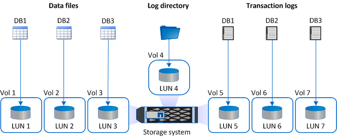

= 8bba878f4ef8e9851514b1602ffa3558
:allow-uri-read: 
:icons: font
:imagesdir: ../media/

[role="lead"]
51a684702bc20b80caa9931dcd42a10a

534eca272452e7a4755aac48e60475e6

5970c71ffec04ba2b4bd7d224b426317

== e774da4149d5c9e64a39ca429dc65142

dfcd8a1ed291d3c9e3c360accb3b665f

* 1db2023c0d8598f4c1709949a52d99a3
* 47a235a5528bec636da21df658ddec17
* 2e72ec77bfcc0c6639076449eb3d60a7
* e06ceaec3a44798c35c988989112d1de
* 31a8d85b6a44cffc2c7dfc6387696f31

1f59dd7d8ae37b4eae492c646a545da7

5d735d78e3400b248601d4a741bf2e63

== ab35c93087c633d8281b0c4b384cf07a

bf74cb13cff6b681c3841651b1565833

6ebb1d8204a3f5ccb6a30b7a2db11a9b

image::../media/smsql_storage_layout_mult_dbs_luns_snapcenter.gif[25c85874ae20ab3be8a403d9c5220b75]

cf7e2c2ef62f545e253e0bcac01fbd88

image::../media/smsql_storage_layout_large_dbs_vmdk.gif[4c0269090807255fcd5e5ba99e9ba6b5]

acc34d774648197faa78322b05b1a828

image::../media/smsql_storage_layout_med_small_dbs_vmdk.gif[649f15576faed4804f780600790fe1a2]
