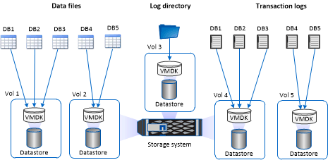

= SnapCenter Plug-in for Microsoft SQL Server のストレージレイアウトに関する推奨事項
:allow-uri-read: 
:icons: font
:imagesdir: ../media/

[role="lead"]
ストレージレイアウトが適切に設計されているため、SnapCenterサーバでデータベースをバックアップしてリカバリ目標を達成できます。ストレージレイアウトを定義する際には、データベースのサイズ、データベースの変更率、バックアップの実行頻度など、いくつかの要素を考慮する必要があります。

以降のセクションでは、 SnapCenter Plug-in for Microsoft SQL Server がインストールされている環境での、 LUN と仮想マシンディスク（ VMDK ）のストレージレイアウトに関する推奨事項と制限について説明します。

この場合、LUNには、VMware RDMディスクと、ゲストにマッピングされたiSCSI直接接続LUNを含めることができます。

== LUNとVMDKの要件

次のデータベースのパフォーマンスと管理を最適化するために、必要に応じて専用のLUNまたはVMDKを使用できます。

* マスターおよびモデルシステムデータベース
* tempdb
* ユーザデータベースファイル（.mdfおよび.ndf）
* ユーザデータベースのトランザクションログファイル（.ldf）
* ログディレクトリ

大規模なデータベースをリストアする場合は、専用のLUNまたはVMDKを使用することを推奨します。LUNまたはVMDK全体のリストアにかかる時間は、LUNまたはVMDKに格納されている個 々 のファイルのリストアにかかる時間よりも短くなります。

ログディレクトリについては、データファイルまたはログファイルのディスクに十分な空きスペースを確保するために、独立したLUNまたはVMDKを作成する必要があります。

== LUNおよびVMDKのサンプルレイアウト

次の図は、LUN上の大規模データベースのストレージレイアウトを設定する方法を示しています。

image::../media/smsql_storage_layout_mult_vols_snapcenter.gif[複数の LUN]

次の図は、LUN上の中規模または小規模データベースのストレージレイアウトを設定する方法を示しています。

image::../media/smsql_storage_layout_mult_dbs_luns_snapcenter.gif[各 LUN に複数のデータベースがある場合]

次の図は、VMDK上の大規模データベースのストレージレイアウトを設定する方法を示しています。

image::../media/smsql_storage_layout_large_dbs_vmdk.gif[VMDK 上の大規模データベースのストレージレイアウト]

次の図は、VMDK上の中規模または小規模のデータベースのストレージレイアウトを設定する方法を示しています。

