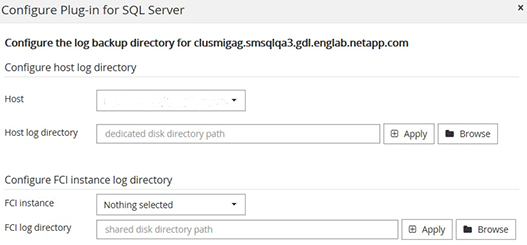

= a3c94a7e24d43ebc327c3a46c41a87f3
:allow-uri-read: 
:icons: font
:imagesdir: ../media/

[role="lead"]
299b0fb149316f6b363487d752e60e5b

.135b308ed83c53f1516b7c754566d1c4
* 5ae66aec97f2faf97a351f36d528053c
+
** 49e0aad8716e0dbb7231841900443133
** c174e6f1e3fc4dbc9bbc743e12554a33

* 8f05fee715847e93ae80e8cf617cceb9
* afaa5b2bc1434ec7ffc7373a3d37ff03
* b5eb0b5304f9fc2eda1c4758804a309a
* 495a029c5d7c250f801f4d0c65513c50
+
0de12d2b98809501852e5dfe1c4da97c

.bbe48fb854ea022537208eeeff822f91
302ca62990c674aa6f608e6444c00482

e0a6a8624a69b68bc0839f233664cd97

e11f6d0c6669ff79495717e9f38e9fc3

.f3a29486bed19a90f2da6d007818b427
. 6e495826070e65e2f969743716fcc30b
. 92167459928f7cb7035350c0b52437da
. fa12509cfb8e8ccded16e2a254e988c4
. c259ed629dc67d1a7600c880484eb692
+
|===
| 21f831502a413a739e20cbf9f2eefe54 | 5e2ad6fd9deb412d871137094ee43ef0 

 a| 
c2ece9a18147c056e75e4008644a9526
 a| 
eeb5e375c18c19a8f7f35271d9bde3ca

7195a4cd88071d03558b86e05a35dd43

 a| 
dae4a538d4ca7b6c0789932062fe718d
 a| 
281d15b67e07b0431db341ff866ac41e

585f8abd7ea20e2c83d9599009debe23

ad0f209682d80f1f65a22a0d900f6e44

** 54f3045d4ebbbd4bbe0a0648d758b68f
** 2758b33784ac351d9783054b024e3269

 a| 
2daf1cb573c2c61422faf64610cf9402
 a| 
37a4ef4c6afce7615b561f36ab496d7b

d7aaccf1cb188ee706ca8017bdca7afb

NOTE: 7d9e230d8206a8a438661f184f270f56

|===
. 6713a944106a8fc2013452c33156ae8d
. b0f08815e23be7ac7c232a9a309233ba
+
|===
| 21f831502a413a739e20cbf9f2eefe54 | 5e2ad6fd9deb412d871137094ee43ef0 

 a| 
60aaf44d4b562252c04db7f98497e9aa
 a| 
33152c09cb2f63e662eead2d52c304c9

NOTE: 715f053db5d8f4a2009a86dc1edc360a

 a| 
5dc1b0641298a4446796a3eaf96c13d9
 a| 
7c17d959a40ec6ab9b468fec4f8f6d87

 a| 
3c8b950c84a4de35d80a465ed87f5fc3
 a| 
ee00c31059f22ec3b8beab1b62936c4e

 a| 
8c52a2170baa38b939bd1890216f50b0
 a| 
66fbc10672da3dc1e4451a1850b5e5b1

 a| 
193c67ad9a593e499fcbd4795d42fe04
 a| 
8726526590ca684b1f852927da592b2b

ec5329c8e55159fbb40b18d6e5ab2599

NOTE: 4ced74f19d0af1905bae82fc201e12b3

|===
. b623e6ded9a852f4e7cd9765578d0c08
. 17bb48cb5022ca80557cfc9621510f56
+
.. 05bb5a497f917848f517fcac62315ce3
+
a2e95b3d87ce22a616602c8fe4a615be

+

+
... 4ec95bc4f94136d65bed56645b271dc1
... d687c5d710656984c3ed7b21d450d2bc
... 10492389e94efdebbb66f7b0cd8a1324

. b623e6ded9a852f4e7cd9765578d0c08
+
f12114bdb8ab18be62b5bcb364a98685

+
c181770b13b5991ed973b65ad0a64c1f

+

NOTE: dd81c680ca1fd86d935da9ccaf370cee

. d85bbbe120029d5b6ffbe773f5192a80

