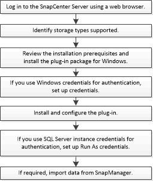

= SnapCenter Plug-in for Microsoft SQL Server のインストールワークフロー
:icons: font
:imagesdir: ../media/

[role="lead"]
SQL Server データベースを保護する場合は、 SnapCenter Plug-in for Microsoft SQL Server をインストールしてセットアップする必要があります。

