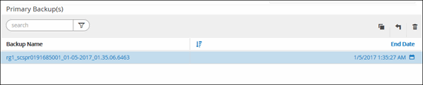

= SQL Server データベースのバックアップをリストアする
:icons: font
:imagesdir: ../media/

[role="lead"]
SnapCenter を使用して、バックアップされた SQL Server データベースをリストアできます。データベースのリストアは段階的に実施され、すべてのデータページとログページが指定した SQL Server バックアップから指定したデータベースにコピーされます。

* このタスクについて *

* バックアップされた SQL Server データベースを、バックアップが作成されたホスト上の別の SQL Server インスタンスにリストアすることができます。
+
本番バージョンを置き換えないように、 SnapCenter を使用して、バックアップされた SQL Server データベースを別のパスにリストアすることができます。

* SnapCenter では、 SQL Server クラスタグループをオフラインにすることなく、 Windows クラスタ内のデータベースをリストアできます。
* リストア処理中に、リソースを所有するノードがダウンするなどのクラスタ障害（クラスタグループの移動処理）が発生した場合は、 SQL Server インスタンスに再接続してからリストア処理を再開する必要があります。
* ユーザまたは SQL Server Agent ジョブがデータベースにアクセスしている間は、データベースをリストアできません。
* システムデータベースは別のパスにリストアできません。
* リストアウィザードの各ページのフィールドのほとんどはわかりやすいもので、説明を必要としません。以下の手順では、説明が必要なフィールドを取り上げます。

* 手順 *

. 左側のナビゲーションペインで、 * リソース * をクリックし、リストから適切なプラグインを選択します。
. [* リソース ] ページで、 [ * 表示 ] リストから [ * データベース * ] または [ * リソースグループ * ] を選択します。
. リストからデータベースまたはリソースグループを選択します。
+
トポロジページが表示されます。

. ［ * コピーの管理 * ］ 表示から、ストレージ・システムから ［ * バックアップ * ］ を選択します。
. 表からバックアップを選択し、をクリックします image:../media/restore_icon.gif["リストアアイコン"] をクリックします。
+

. [* リストア範囲 *] ページで、次のいずれかのオプションを選択します。
+
|===
| オプション | 説明 

 a| 
バックアップが作成されたホストにデータベースをリストアします
 a| 
バックアップを作成した SQL Server にデータベースをリストアする場合は、このオプションを選択します。

 a| 
データベースを代替ホストにリストアします
 a| 
バックアップを作成したホストと同じまたは別のホストの別の SQL Server にデータベースをリストアする場合は、このオプションを選択します。

ホスト名を選択し、データベース名を指定し（オプション）、インスタンスを選択し、リストアパスを指定します。

NOTE: 代替パスに指定するファイル拡張子は、元のデータベースファイルのファイル拡張子と同じにする必要があります。

[ リストア範囲 ] ページに [ データベースを別のホストにリストアする *] オプションが表示されない場合は、ブラウザキャッシュをクリアします。

 a| 
既存のデータベースファイルを使用してデータベースをリストアします
 a| 
バックアップを作成したホストと同じまたは別のホストの代替 SQL Server にデータベースをリストアする場合は、このオプションを選択します。

指定した既存のファイルパスには、データベースファイルがすでに存在している必要があります。ホスト名を選択し、データベース名を指定し（オプション）、インスタンスを選択し、リストアパスを指定します。

|===
. [* Recovery Scope] ページで、次のいずれかのオプションを選択します。
+
|===
| オプション | 説明 

 a| 
なし
 a| 
ログなしでフルバックアップのみをリストアする必要がある場合は、「 * なし」を選択します。

 a| 
すべてのログバックアップ
 a| 
フルバックアップ後に使用可能なすべてのログバックアップをリストアするには、「 * all log backups * up-to-the-minute backup restore operation 」を選択します。

 a| 
までログバックアップでバックアップします
 a| 
「ログバックアップによる * 」を選択してポイントインタイムリストア処理を実行します。この場合、選択した日付のバックアップログまで、バックアップログに基づいてデータベースがリストアされます。

 a| 
期限までの特定の日付
 a| 
リストアされたデータベースにトランザクション・ログを適用しない日時を指定するには、 [ * までの特定の日付 ] を選択します。

ポイントインタイムリストア処理では、指定した日時以降に記録されたトランザクションログエントリがリストアされません。

 a| 
カスタムログディレクトリを使用します
 a| 
すべてのログ・バックアップ * 、ログ・バックアップ * 、または * を指定日までに * とログがカスタム・ロケーションにある場合は、 * カスタム・ログ・ディレクトリを使用 * を選択し、ログの場所を指定します。

NOTE: 可用性グループデータベースではカスタムログディレクトリはサポートされません。

|===
. [* Pre Ops * （プリ・オペレーション * ） ] ページで、次の手順を実行します。
+
.. [* リストア前オプション * ] ページで、次のいずれかのオプションを選択します。
+
*** [ リストア時に同じ名前でデータベースを上書きする ] を選択して、同じ名前でデータベースをリストアします。
*** データベースをリストアし、既存のレプリケーション設定を保持するには、「 * SQL データベースのレプリケーション設定を保持 * 」を選択します。
*** リストア処理を開始する前にトランザクションログバックアップを作成する場合は、「リストア前にトランザクションログバックアップを作成」を選択します。
*** トランザクションログのバックアップに失敗した場合は、「 * リストアの終了」を選択して、リストア処理を中止します。

.. リストアジョブの実行前に実行するオプションのスクリプトを指定します。
+
たとえば、 SNMP トラップの更新、アラートの自動化、ログの送信などをスクリプトで実行できます。

. [* Post Ops * ] ページで、次の手順を実行します。
+
.. リストア完了後のデータベース状態の選択セクションで、次のいずれかのオプションを選択します。
+
*** 必要なすべてのバックアップを今すぐリストアする場合は、「動作中ですが、追加のトランザクション・ログをリストアできません」を選択します。
+
これはデフォルトの動作で、コミットされていないトランザクションをロールバックすることでデータベースを使用可能な状態にします。バックアップを作成するまで追加のトランザクションログはリストアできません。

*** [ 非運用時 ] を選択します。ただし、トランザクションログを追加でリストアすることができます。 * を選択すると、コミットされていないトランザクションをロールバックせずに、データベースが非運用状態のままになります。
+
追加のトランザクションログをリストアできます。データベースはリカバリされるまで使用できません。

*** データベースを読み取り専用モードのままにするには、追加のトランザクションログのリストアに使用できる * 読み取り専用モードを選択します。
+
コミットされていないトランザクションはロールバックされますが、ロールバックされた操作がスタンバイファイルに保存されるため、リカバリ前の状態に戻すことができます。

+
[ ディレクトリを元に戻す ] オプションが有効になっている場合は、さらに多くのトランザクションログがリストアされます。トランザクションログのリストア処理が失敗した場合は、変更をロールバックできます。詳細については、 SQL Server のマニュアルを参照してください。

.. リストアジョブの実行後に実行するオプションのスクリプトを指定します。
+
たとえば、 SNMP トラップの更新、アラートの自動化、ログの送信などをスクリプトで実行できます。

. [*Notification] ページの [*Email preference*] ドロップダウンリストから、電子メールを送信するシナリオを選択します。
+
また、送信者と受信者の E メールアドレス、および E メールの件名を指定する必要があります。

. 概要を確認し、 [ 完了 ] をクリックします。
. [ * Monitor * > * Jobs * ] ページを使用してリストア・プロセスを監視します。

* 詳細はこちら *

link:task_restore_and_recover_resources_using_powershell_cmdlets.html["PowerShell コマンドレットを使用してリソースをリストアおよびリカバリする"]

link:task_restore_a_sql_server_database_from_secondary_storage.html["セカンダリストレージから SQL Server データベースをリストアする"]
