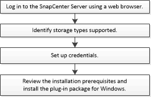

= SnapCenter Plug-in for Microsoft Windows のインストールワークフロー
:icons: font
:imagesdir: ../media/

[role="lead"]
データベースファイル以外の Windows ファイルを保護する場合は、 SnapCenter Plug-in for Microsoft Windows をインストールしてセットアップする必要があります。

